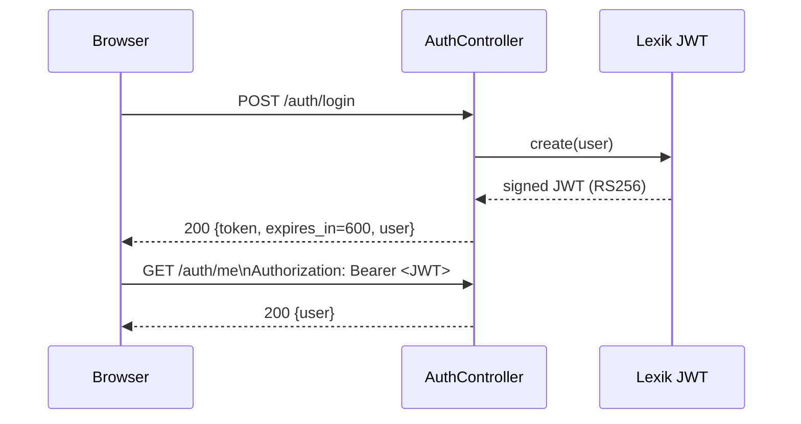
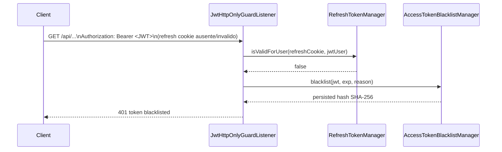

# Access Token (JWT)

Este documento descreve o ciclo completo do Access Token no backend `www`.

## 1. Resumo

O Access Token e um JWT assinado (RS256) emitido pelo Lexik JWT.

Caracteristicas principais:
- curto prazo: `JWT_TOKEN_TTL=600` (10 minutos)
- transporte: `Authorization: Bearer <jwt>`
- nao e persistido em texto no banco
- pode ser invalidado via blacklist por hash SHA-256

Fonte no codigo:
- `src/Controller/AuthController.php`
- `src/EventListener/JwtHttpOnlyGuardListener.php`
- `src/Security/AccessTokenBlacklistManager.php`
- `src/Entity/AccessTokenBlacklist.php`

## 2. Emissao

O token e emitido em:
- `POST /auth/login`
- `POST /auth/google`
- `POST /auth/refresh`

Resposta padrao:

```json
{
  "token": "<JWT>",
  "token_type": "Bearer",
  "expires_in": 600,
  "user": {
    "id": 1,
    "email": "admin@example.com",
    "roles": ["ROLE_USER"],
    "isActive": true
  }
}
```

## 3. Claims esperadas

Claims mais relevantes no payload JWT:
- `exp`: expiracao
- `iat`: emissao
- `username` (ou `sub`): identificador do usuario
- `roles`: permissoes

Observacao: os claims finais sao gerados pelo Lexik JWT a partir da entidade `User`.

## 4. Diagrama de Sequencia (Emissao e Uso)



## 5. Regra de Vinculo JWT + Cookie Refresh

O listener `JwtHttpOnlyGuardListener` aplica uma regra critica em rotas protegidas:
- se houver `Authorization: Bearer`, o backend exige que o cookie refresh correspondente tambem seja valido para o mesmo usuario
- se falhar, o JWT e colocado em blacklist

Rotas publicas de auth sao excecao (`/auth/login`, `/auth/google`, `/auth/refresh`, `/auth/logout`, `/auth/csrf/challenge`, etc.).

## 6. Diagrama de Sequencia (Blacklist por Mismatch)



## 7. Blacklist

Tabela: `access_token_blacklist`

Campos principais:
- `token_hash` (SHA-256 do JWT)
- `reason`
- `created_at`
- `expires_at`

Comportamento:
- `isBlacklisted(jwt)` consulta hash ativo
- `blacklist(jwt, exp, reason)` evita duplicidade e estende expiracao quando necessario

## 8. Configuracao

Arquivo: `www/.env`

```dotenv
JWT_TOKEN_TTL=600
```

## 9. Exemplo cURL

```bash
# Login para obter Access Token
curl -k -i 'https://localhost/ModFederation/api/auth/login' \
  -H 'Content-Type: application/json' \
  -d '{"email":"admin@example.com","password":"Senha@123"}'

# Uso em rota protegida
curl -k -i 'https://localhost/ModFederation/api/auth/me' \
  -H 'Authorization: Bearer <JWT>'
```
