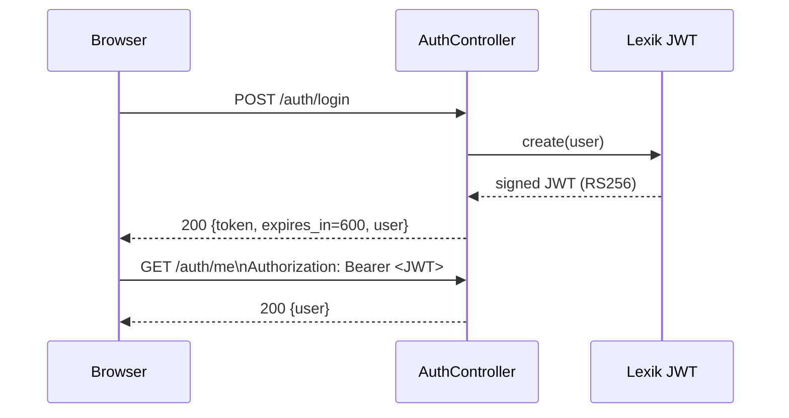
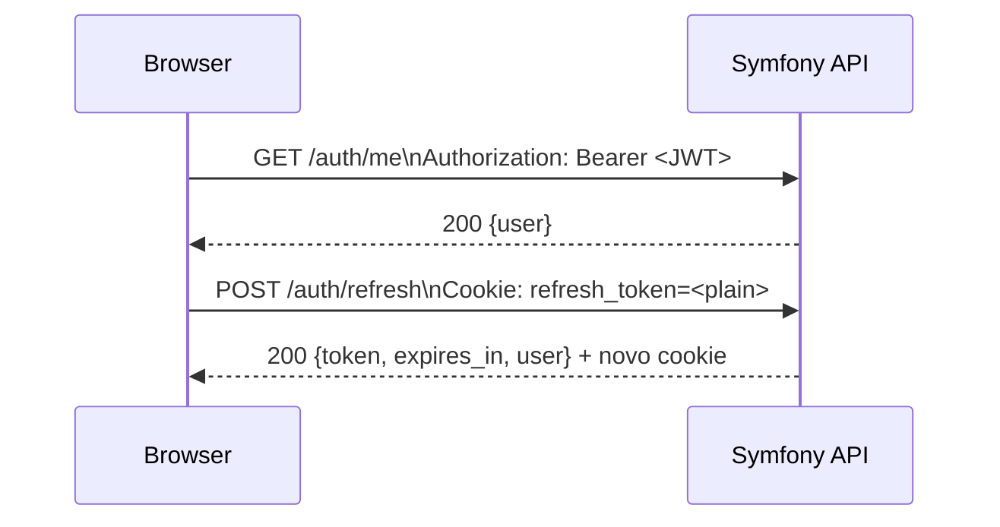

# Access Token (JWT)

Este documento descreve o ciclo completo do Access Token no backend `www`.

## 1. Resumo

O Access Token e um JWT assinado (RS256) emitido pelo Lexik JWT.

Caracteristicas principais:
- curto prazo: `JWT_TOKEN_TTL=600` (10 minutos)
- transporte: `Authorization: Bearer <jwt>`
- nao e persistido em texto no banco
- nao depende mais de validacao conjunta com refresh token em toda rota protegida

Fonte no codigo:
- `src/Controller/AuthController.php`
- `config/packages/security.yaml`

## 2. Emissao

O token e emitido em:
- `POST /auth/login`
- `POST /auth/google`
- `POST /auth/refresh`

Resposta padrao:

```json
{
  "token": "<JWT>",
  "token_type": "Bearer",
  "expires_in": 600,
  "user": {
    "id": 1,
    "email": "admin@example.com",
    "roles": ["ROLE_USER"],
    "isActive": true
  }
}
```

## 3. Claims esperadas

Claims mais relevantes no payload JWT:
- `exp`: expiracao
- `iat`: emissao
- `username` (ou `sub`): identificador do usuario
- `roles`: permissoes

Observacao: os claims finais sao gerados pelo Lexik JWT a partir da entidade `User`.

## 4. Diagrama de Sequencia (Emissao e Uso)



## 5. Regra atual de uso com Refresh Token

O fluxo atual funciona assim:
- o frontend usa `Authorization: Bearer <JWT>` nas rotas protegidas
- o refresh token fica em cookie HttpOnly
- o refresh token so e usado nos endpoints de autenticacao, principalmente `POST /auth/refresh`
- se o access token expirar e o refresh token nao existir ou estiver invalido, o usuario perde a sessao

Isso remove a exigencia anterior de enviar `JWT + refresh cookie` em toda request autenticada.

## 6. Diagrama de Sequencia (Uso normal + Renovacao)



## 7. Cookie de Refresh

- salvo como `HttpOnly`
- emitido no login, login Google e refresh
- escopo de path restrito a `/auth`
- nao precisa acompanhar as rotas protegidas comuns

## 8. Configuração

Arquivo: `www/.env`

```dotenv
JWT_TOKEN_TTL=600
```

## 9. Exemplo cURL

```bash
# Login para obter Access Token
curl -k -i 'https://localhost/ModFederation/api/auth/login' \
  -H 'Content-Type: application/json' \
  -d '{"email":"admin@example.com","password":"Senha@123"}'

# Uso em rota protegida
curl -k -i 'https://localhost/ModFederation/api/auth/me' \
  -H 'Authorization: Bearer <JWT>'

# Renovacao de sessao quando o JWT expirar
curl -k -i -b cookies.txt -c cookies.txt \
  -X POST \
  -H 'X-CSRF-Token: <TOKEN_COMPOSTO>' \
  -H 'X-CSRF-Action: auth.refresh' \
  'https://localhost/ModFederation/api/auth/refresh'
```
