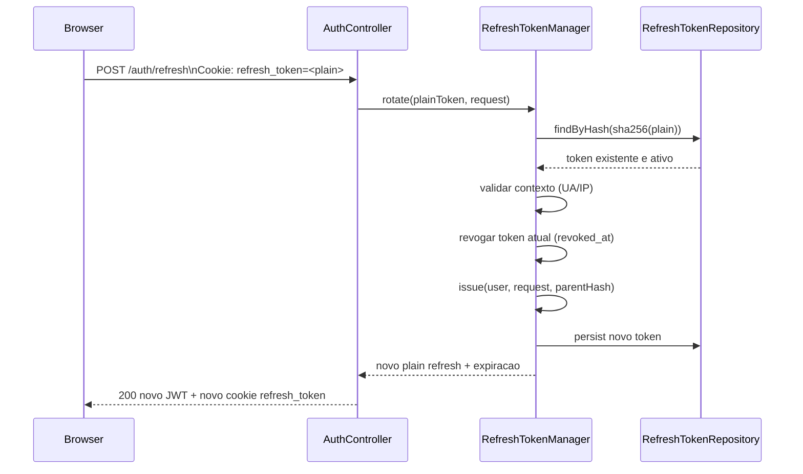
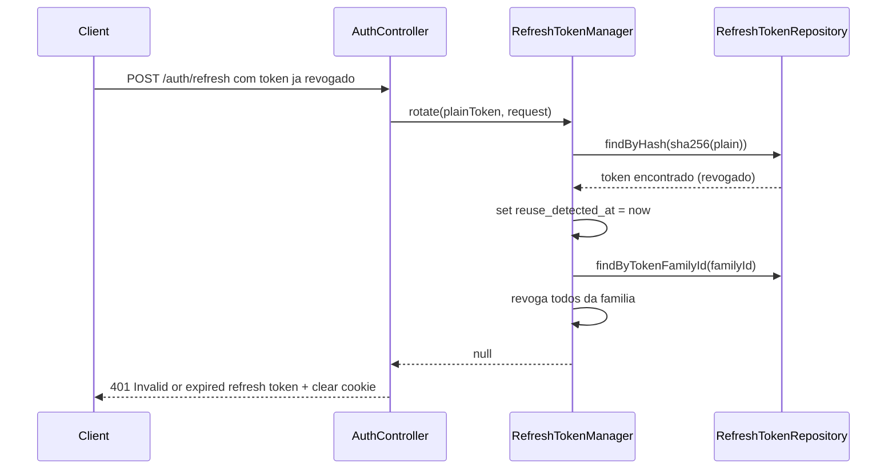

# Refresh Token

Este documento descreve o fluxo e as regras do Refresh Token no backend `www`.

## 1. Resumo

O Refresh Token e uma string opaca, longa, usada para renovar o Access Token sem novo login.

Caracteristicas principais:
- formato: `bin2hex(random_bytes(64))` (128 hex chars)
- armazenamento no cliente: cookie `HttpOnly`
- armazenamento no servidor: apenas hash SHA-256 (`token_hash`)
- rotacao obrigatoria a cada uso
- deteccao de reuso com revogacao em cascata por familia

Fonte no codigo:
- `src/Security/RefreshTokenManager.php`
- `src/Entity/RefreshToken.php`
- `src/Repository/RefreshTokenRepository.php`
- `src/Controller/AuthController.php`

## 2. Cookie e Configuração

Arquivo: `www/.env`

```dotenv
AUTH_REFRESH_TOKEN_TTL=1209600
AUTH_REFRESH_TOKEN_COOKIE_NAME=refresh_token
AUTH_REFRESH_COOKIE_SECURE=1
AUTH_REFRESH_COOKIE_SAMESITE=none
```

Resumo:
- TTL: 14 dias
- cookie name: `refresh_token`
- `HttpOnly=true` (definido em `AuthController`)
- `Secure=true`
- `SameSite=none` (necessario para cenario cross-origin)

## 3. Estrutura de Persistencia

Tabela: `refresh_token`

Campos chave:
- `token_hash`
- `token_family_id`
- `parent_token_hash`
- `fingerprint_hash`
- `user_agent_hash`
- `ip_hash`
- `revoked_at`
- `context_changed_at`
- `reuse_detected_at`
- `expires_at`

## 4. Diagrama de Sequencia (Refresh Normal com Rotacao)



## 5. Diagrama de Sequencia (Reuso Detectado)



## 6. Fluxo de Emissao

O Refresh Token e emitido em:
- `POST /auth/login`
- `POST /auth/google`
- `POST /auth/refresh` (rotacao)

Sempre via `Set-Cookie` no response, nunca no body.

## 7. Regras Importantes

- token plaintext nunca vai para banco
- token revogado nao pode ser usado novamente
- reuso detectado revoga toda a familia
- mudanca forte de contexto (UA/IP) marca `context_changed_at`
- logout revoga token atual e limpa cookie

## 8. Exemplo cURL

```bash
# Requer cookie refresh_token valido salvo em cookies.txt
curl -k -i -b cookies.txt -c cookies.txt \
  -H 'Content-Type: application/json' \
  -H 'X-CSRF-Token: <TOKEN_COMPOSTO>' \
  -H 'X-CSRF-Action: auth.refresh' \
  -X POST 'https://localhost/ModFederation/api/auth/refresh'
```

Observacao: `/auth/refresh` tambem exige challenge CSRF valido.
