# Diagrama de Sequencia do Sistema

Baseado no codigo real atual do projeto.

## Escopo confirmado no codigo

- Frontend principal: `frontend/Host-app`
- Componentes remotos via Module Federation: `frontend/Components-app`
- Backend: `www/src/Controller`
- Persistencia principal:
  - `app_user`
  - `refresh_token`
  - `local_task`
  - `github_account`
  - `github_repository`
  - `github_cached_issue`
  - `ui_settings`
- Integracao externa:
  - Google OAuth
  - GitHub GraphQL/API

## Observacoes importantes antes do diagrama

- O host controla autenticacao, token, CSRF, retries e orquestracao.
- O remote hoje fornece componentes de interface reutilizaveis.
- O fluxo real de tarefas usado no host passa por `TasksScreen` e pelos endpoints `/tasks/local-issues`.
- Existe um `TaskCrudPanel` remoto antigo com expectativa de endpoints genericos em `/tasks` e operacao `DELETE`, mas isso nao bate com o backend atual.
- No backend atual nao existe `DELETE /tasks/local-issues/{id}`.
- O delete real confirmado no sistema hoje existe para:
  - contas GitHub
  - repositorios GitHub

---

## 1. Visao geral do sistema

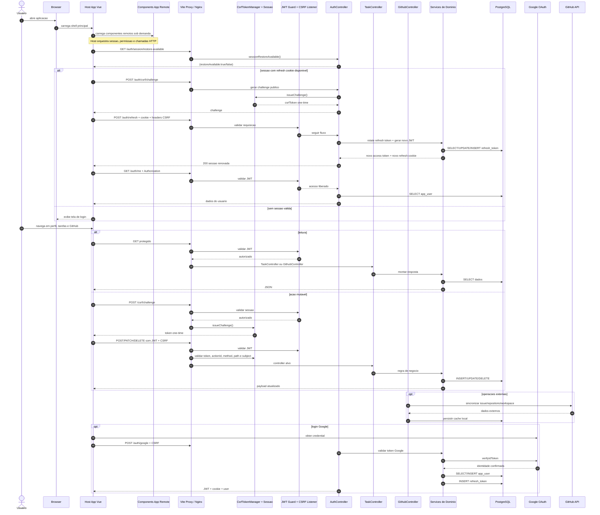

---

## 2. Login local completo

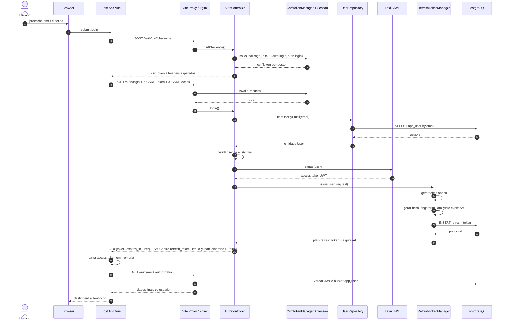

---

## 3. Renovacao automatica de sessao

```mermaid
sequenceDiagram
    autonumber
    participant Host as Host App Vue
    participant Gateway as Vite Proxy / Nginx
    participant Auth as AuthController
    participant Csrf as CsrfTokenManager + Sessao
    participant RTM as RefreshTokenManager
    participant DB as PostgreSQL

    Note over Host: fluxo executado no boot da app e em 401 de rotas protegidas

    Host->>Gateway: GET /auth/session/restore-available
    Gateway->>Auth: sessionRestoreAvailable()
    Auth-->>Host: {restoreAvailable:true/false}

    alt restoreAvailable=true
    Host->>Gateway: POST /auth/csrf/challenge
    Gateway->>Auth: csrfChallenge(auth.refresh)
    Auth->>Csrf: issueChallenge()
    Csrf-->>Auth: token one-time
    Auth-->>Host: challenge

    Host->>Gateway: POST /auth/refresh + refresh cookie + headers CSRF
    Gateway->>Csrf: validar challenge
    Csrf-->>Gateway: true
    Gateway->>Auth: refresh()

    Auth->>RTM: rotate(refresh_cookie, request)
    RTM->>DB: SELECT refresh_token por token_hash
    DB-->>RTM: token atual

    alt token valido e ativo
        RTM->>RTM: avaliar mudanca de contexto por fingerprint, UA, IP e localizacao
        alt token revogado reutilizado
            RTM->>DB: UPDATE reuse_detected_at no token atual
            RTM->>DB: UPDATE revoked_at em toda token_family
            RTM-->>Auth: null
            Auth-->>Host: 401 + limpar cookie
            Host->>Host: clearAuth()
        else rotacao normal
            RTM->>DB: UPDATE revoked_at no token atual
            RTM->>DB: INSERT novo refresh_token com parent_token_hash
            RTM-->>Auth: novo refresh plain + expiresAt
            Auth-->>Host: 200 novo JWT + novo Set-Cookie
            Host->>Host: substitui token em memoria
        end
    else token ausente, expirado ou invalido
        Auth-->>Host: 401 invalid or expired refresh token
        Host->>Host: limpar sessao local
    end
    else restoreAvailable=false
        Host->>Host: nao tenta refresh e segue para login
    end
```

---

## 4. Regra de protecao para rotas autenticadas

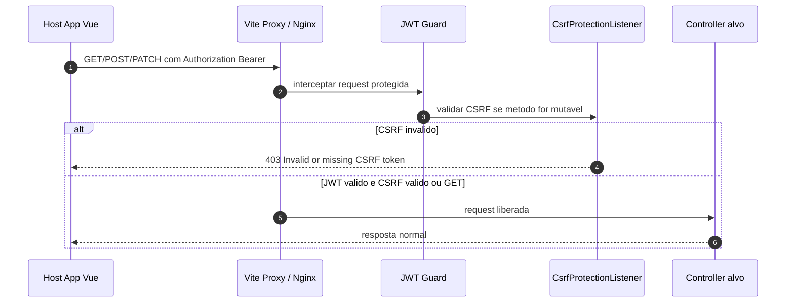

---

## 5. Carregamento da tela de tarefas

Fluxo real atual usado pelo host.

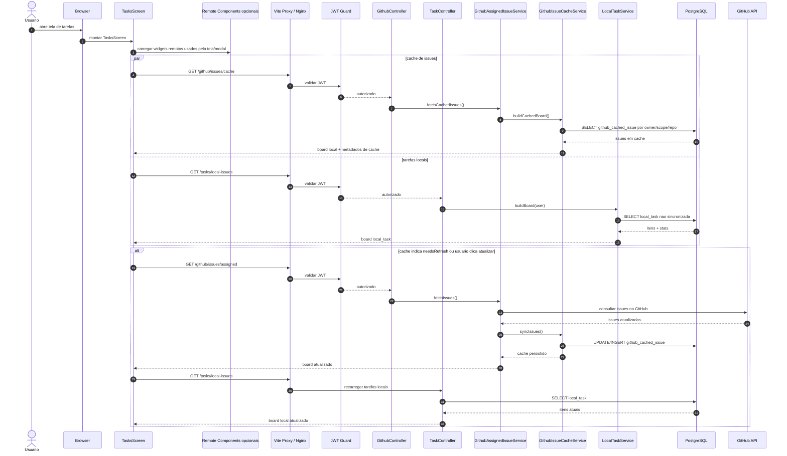

---

## 6. Criacao de tarefa local

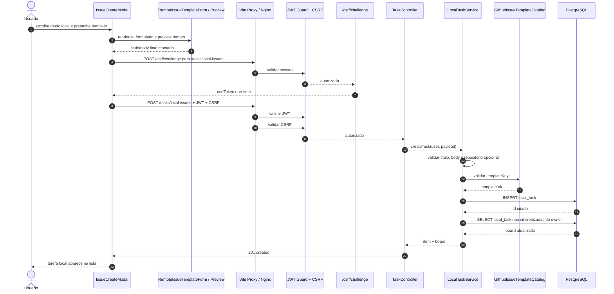

---

## 7. Edicao de tarefa local

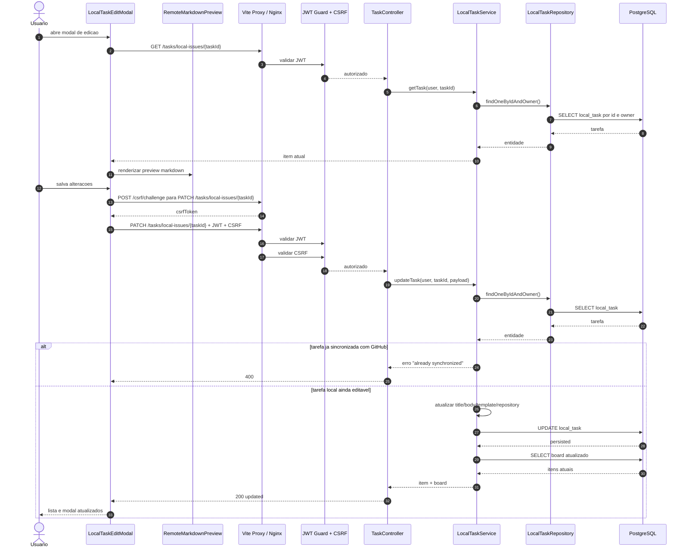

---

## 8. Sincronizacao da tarefa local para o GitHub

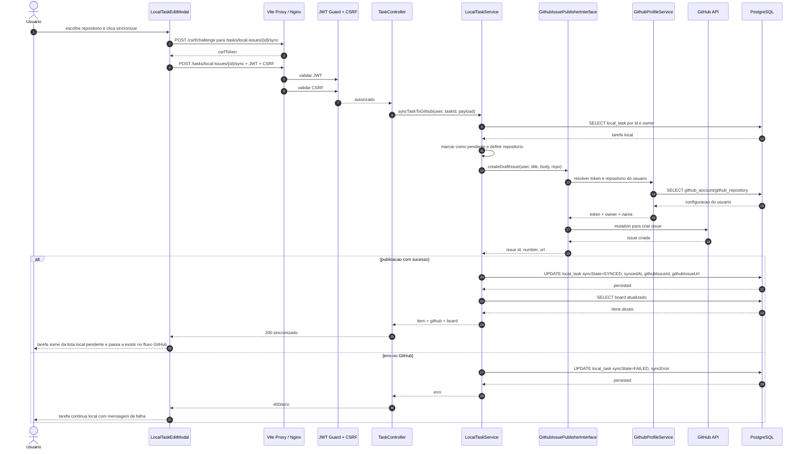

---

## 9. Atualizacao de issue GitHub

Esse fluxo existe no sistema e passa por GitHub + cache local.

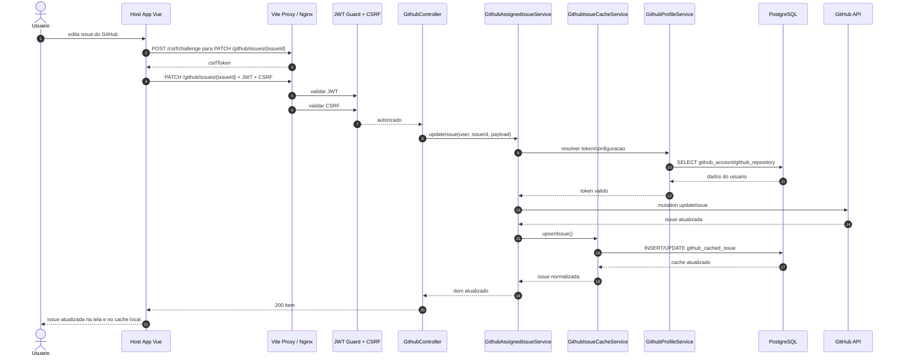

---

## 10. Delete real existente no sistema

O delete confirmado hoje e de conta GitHub e repositorio GitHub.

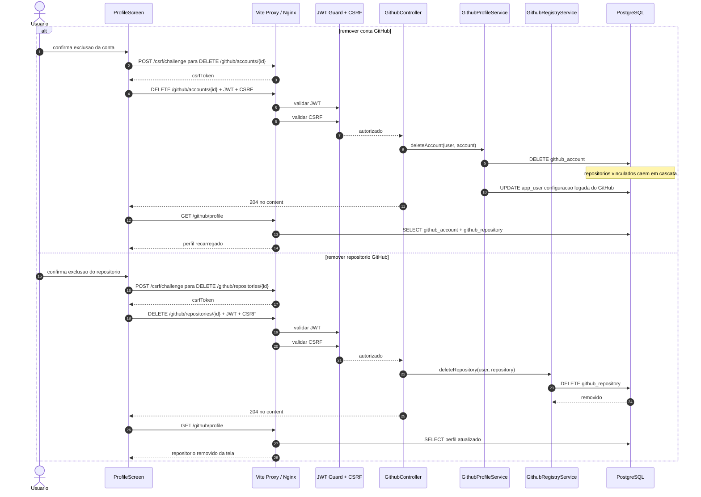

---

## 11. Gap atual do projeto

Esse gap precisa ficar explicito para o diagrama nao mentir.

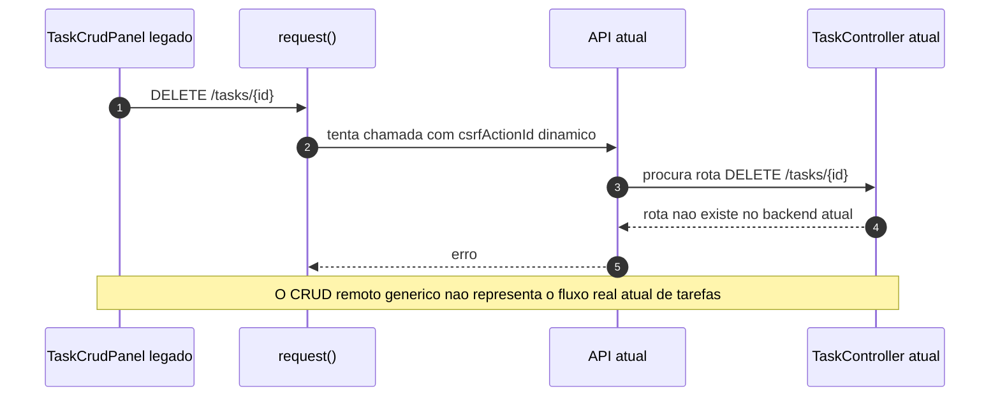

## Resumo pratico

- Login local e Google criam JWT em memoria no host e refresh token em cookie HttpOnly.
- Toda rota protegida depende de JWT valido.
- O refresh token fica restrito aos endpoints de auth e renova a sessao quando o JWT expira.
- Toda rota mutavel depende tambem de challenge CSRF one-time.
- Tarefa local cria e edita em `local_task`.
- Sincronizacao com GitHub move o estado da tarefa local e registra metadados da issue criada.
- Issues do GitHub sao lidas da API externa e persistidas em `github_cached_issue`.
- Deletes reais hoje sao de configuracao GitHub, nao de tarefa local.
