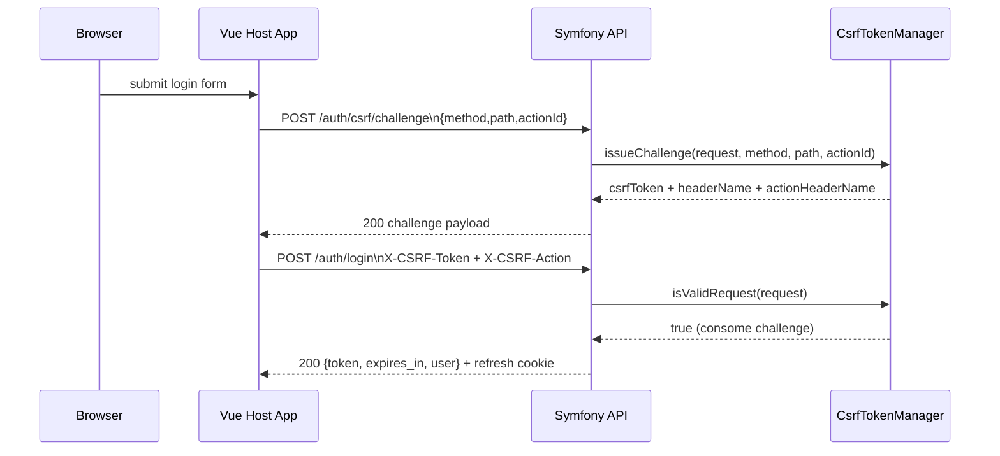
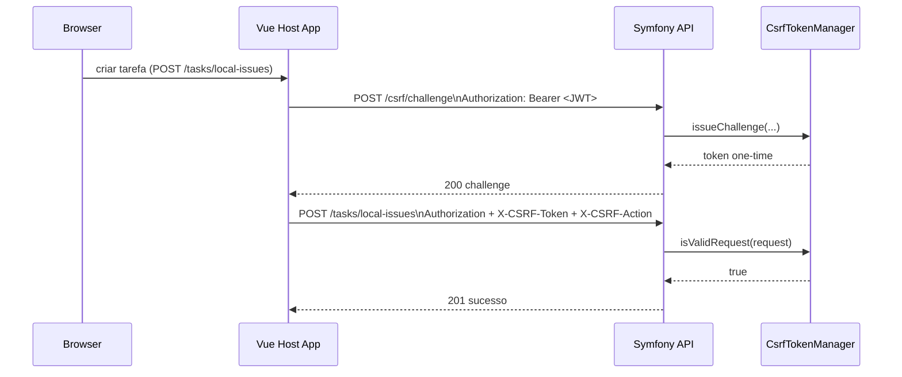

# CSRF Token (Modelo Atual)

> **Nota:** Este documento consolida todo o conteudo sobre CSRF do projeto, incluindo o antigo `CSRF_FORMS.md` que foi descontinuado.

Este documento descreve o fluxo CSRF atual em producao do projeto `www`.

## 1. Resumo

O projeto nao usa mais o padrao double-submit cookie com token reutilizavel.

O modelo atual e:
- challenge por acao (`actionId`)
- token de uso unico
- token vinculado a sujeito + metodo + path
- expiracao curta (maximo 600 segundos)

Fonte no codigo:
- `src/Security/CsrfTokenManager.php`
- `src/EventListener/CsrfProtectionListener.php`
- `src/Controller/AuthController.php` (challenges publicos de auth)
- `src/Controller/CsrfChallengeController.php` (challenges autenticados)

## 2. Endpoints de Challenge

## 2.1 Acoes publicas de auth

`POST /auth/csrf/challenge`

Usado para:
- `auth.login` -> `POST /auth/login`
- `auth.register` -> `POST /auth/register`
- `auth.google` -> `POST /auth/google`
- `auth.refresh` -> `POST /auth/refresh`
- `auth.logout` -> `POST /auth/logout`

Body esperado:

```json
{
  "method": "POST",
  "path": "/auth/login",
  "actionId": "auth.login"
}
```

Observacao: o AuthController valida que o `method` e `path` enviados no body correspondem exatamente ao que esta definido na constante `PUBLIC_CSRF_ACTIONS`.

## 2.2 Acoes autenticadas

`POST /csrf/challenge`

Usado para chamadas mutaveis em:
- `/tasks/*` (tarefas locais)
- `/api/*` (recursos API Platform)
- `/github/*` (workspace, issues, contas, repositorios)
- `/ui/*` (configuracoes de interface)
- `/auth/emails/*` e `/auth/google/link` (gestao de emails e vinculacao Google)

Observacao: este endpoint exige autenticacao (`IS_AUTHENTICATED_FULLY`).

O `CsrfChallengeController` aceita metodos `POST`, `PUT`, `PATCH` e `DELETE`.

## 3. Headers exigidos na requisicao protegida

- `X-CSRF-Token`: token composto `<challengeId>.<plainToken>`
- `X-CSRF-Action`: identificador da acao (ex.: `auth.login`)

Valores padrao no `.env`:

```dotenv
AUTH_CSRF_HEADER_NAME=X-CSRF-Token
AUTH_CSRF_ACTION_HEADER_NAME=X-CSRF-Action
AUTH_CSRF_TOKEN_TTL=600
```

## 4. Diagrama de Sequencia (Login Publico)



## 5. Diagrama de Sequencia (Acao Autenticada)



## 6. Regras de Validacao no Backend

No `CsrfProtectionListener` (priority 25):
- ignora metodos seguros (`GET`, `HEAD`, `OPTIONS`)
- protege paths `^/(auth|tasks|api|github|finance|ui)(?:/|$)`
- exclui `^/(auth/csrf/challenge|csrf/challenge)(?:/|$)`
- quando invalido retorna `403` com payload CSRF

No `CsrfChallengeController`:
- aceita apenas metodos mutaveis: `POST`, `PUT`, `PATCH`, `DELETE`
- protege paths: `/api`, `/github`, `/tasks`, `/ui`, `/auth/emails` e `/auth/google/link`

No `CsrfTokenManager`:
- challenge salvo em sessao (`_custom_csrf_challenges`)
- formato obrigatorio: `^[a-f0-9]{32}\.[a-f0-9]{64}$`
- challenge e removido antes da validacao final (uso unico)
- challenges anteriores para a mesma acao e sujeito sao invalidados ao emitir novo
- valida hash do token, sujeito, metodo, path e actionId
- TTL normalizado para no maximo 600s (`MAX_TOKEN_TTL_SECONDS`)
- actionId deve conter 3-120 caracteres alfanumericos, pontos, hifens ou underscores

## 7. Vinculacao de Sujeito (Subject Binding)

O challenge e vinculado ao sujeito da requisicao:
- `user:<identifier>` se houver bearer JWT valido no header (extraido do payload JWT)
- `refresh:<sha256(cookie_refresh)>` se houver cookie refresh em endpoints de auth
- `anon:<visitorId>` para usuario anonimo em sessao (gerado com `bin2hex(random_bytes(16))`)

Isso evita replay do token CSRF por outro contexto.

## 8. Fluxo no Frontend

Em `frontend/Host-app/src/App.vue`:
- toda chamada mutavel exige `csrfActionId`
- `requestWithCsrf()` pede challenge antes da chamada mutavel
- se vier `403` com erro CSRF, faz 1 retry com novo challenge

## 9. Exemplo cURL (Login)

```bash
# 1) Buscar challenge da acao publica auth.login
curl -k -c cookies.txt \
  -H 'Content-Type: application/json' \
  -d '{"method":"POST","path":"/auth/login","actionId":"auth.login"}' \
  https://localhost:4481/OctoFlow/api/auth/csrf/challenge

# 2) Enviar login com os dois headers CSRF
# Substitua <TOKEN_COMPOSTO> pelo valor csrfToken retornado no passo anterior.
curl -k -b cookies.txt -c cookies.txt \
  -H 'Content-Type: application/json' \
  -H 'X-CSRF-Token: <TOKEN_COMPOSTO>' \
  -H 'X-CSRF-Action: auth.login' \
  -d '{"email":"admin@example.com","password":"Senha@123"}' \
  https://localhost:4481/OctoFlow/api/auth/login
```

## 10. Erro esperado quando invalido

```json
{
  "message": "Invalid or missing CSRF token.",
  "csrf": {
    "header": "X-CSRF-Token",
    "actionHeader": "X-CSRF-Action",
    "mode": "action-scoped-one-time-token"
  }
}
```
