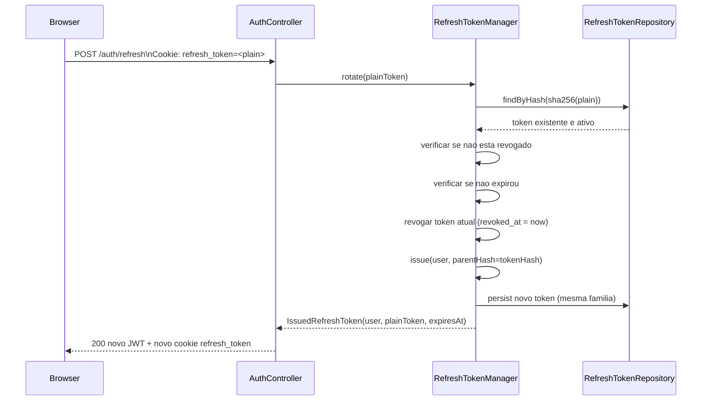
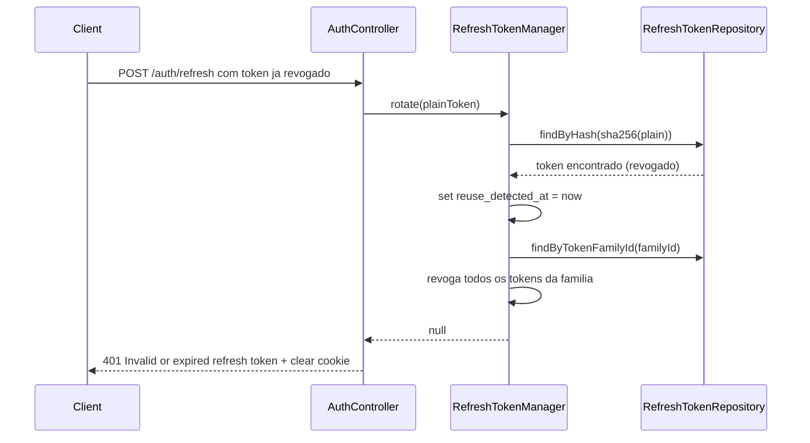

# Refresh Token

Este documento descreve o fluxo e as regras do Refresh Token no backend `www`.

## 1. Resumo

O Refresh Token e uma string opaca, longa, usada para renovar o Access Token sem novo login.

Caracteristicas principais:
- formato: `bin2hex(random_bytes(64))` (128 hex chars)
- armazenamento no cliente: cookie `HttpOnly`
- armazenamento no servidor: apenas hash SHA-256 (`token_hash`)
- rotacao obrigatoria a cada uso
- deteccao de reuso com revogacao em cascata por familia

Fonte no codigo:
- `src/Security/RefreshTokenManager.php`
- `src/Security/IssuedRefreshToken.php`
- `src/Entity/RefreshToken.php`
- `src/Repository/RefreshTokenRepository.php`
- `src/Controller/AuthController.php`

## 2. Cookie e Configuracao

Arquivo: `www/.env`

```dotenv
AUTH_REFRESH_TOKEN_TTL=1209600
AUTH_REFRESH_TOKEN_COOKIE_NAME=refresh_token
AUTH_REFRESH_COOKIE_SECURE=1
AUTH_REFRESH_COOKIE_SAMESITE=none
```

Valores em desenvolvimento (`www/.env.local`):

```dotenv
AUTH_REFRESH_COOKIE_SECURE=0
AUTH_REFRESH_COOKIE_SAMESITE=lax
```

Resumo:
- TTL: 14 dias (1209600 segundos)
- cookie name: `refresh_token`
- `HttpOnly=true` (definido no codigo `AuthController::buildRefreshCookie`)
- `Secure`: `true` em producao, `false` em desenvolvimento
- `SameSite`: `none` em producao, `lax` em desenvolvimento
- path do cookie: `/` (global, nao restrito a `/auth`)

## 3. Estrutura de Persistencia

Tabela: `refresh_token` (PostgreSQL)

Campos da entidade `RefreshToken`:
- `id` (int, auto-incremento)
- `user_id` (FK para `app_user`, CASCADE)
- `token_hash` (varchar 64, unique)
- `fingerprint_hash` (varchar 64)
- `user_agent_hash` (varchar 64)
- `ip_hash` (varchar 64)
- `token_family_id` (varchar 64, nullable)
- `parent_token_hash` (varchar 64, nullable)
- `expires_at` (datetime immutable)
- `created_at` (datetime immutable)
- `revoked_at` (datetime immutable, nullable)
- `context_changed_at` (datetime immutable, nullable)
- `reuse_detected_at` (datetime immutable, nullable)

Indices definidos na entidade:
- `idx_refresh_token_expires` (expires_at)
- `idx_refresh_token_user` (user_id)
- `idx_refresh_token_family` (token_family_id)
- `idx_refresh_token_fingerprint` (fingerprint_hash)

## 4. Diagrama de Sequencia (Refresh Normal com Rotacao)



## 5. Diagrama de Sequencia (Reuso Detectado)



## 6. Fluxo de Emissao

O Refresh Token e emitido em:
- `POST /auth/login`
- `POST /auth/register`
- `POST /auth/google`
- `POST /auth/refresh` (rotacao)

Sempre via `Set-Cookie` no response, nunca no body.

Metodo `createAuthenticatedResponse()` no `AuthController` chama `RefreshTokenManager::issue(user)`.
Metodo `refresh()` no `AuthController` chama `RefreshTokenManager::rotate(plainToken)`.

## 7. Assinaturas dos Metodos Principais

```php
// Emissao de novo token
public function issue(User $user, ?string $parentTokenHash = null): IssuedRefreshToken

// Rotacao (consome token antigo + emite novo)
public function rotate(string $plainToken): ?IssuedRefreshToken

// Validacao sem consumir
public function isValid(?string $plainToken): bool

// Validacao para um usuario especifico
public function isValidForUser(?string $plainToken, ?string $userIdentifier): bool

// Revogacao explicita
public function revokeByPlainToken(?string $plainToken): void

// Limpeza de tokens expirados
public function cleanupExpiredTokens(): int
```

## 8. Regras Importantes

- token plaintext nunca vai para banco (apenas hash SHA-256)
- token revogado nao pode ser usado novamente
- reuso detectado revoga toda a familia (cascading revocation)
- token family ID e herdado do pai na rotacao
- token expirado nao pode ser usado para rotacao
- logout revoga token atual e limpa cookie
- logout tambem invalida sessao e limpa cookie de sessao

## 9. Exemplo cURL

```bash
# Requer cookie refresh_token valido salvo em cookies.txt
curl -k -i -b cookies.txt -c cookies.txt \
  -H 'Content-Type: application/json' \
  -H 'X-CSRF-Token: <TOKEN_COMPOSTO>' \
  -H 'X-CSRF-Action: auth.refresh' \
  -X POST 'https://localhost:4481/OctoFlow/api/auth/refresh'
```

Observacao: `/auth/refresh` tambem exige challenge CSRF valido.
